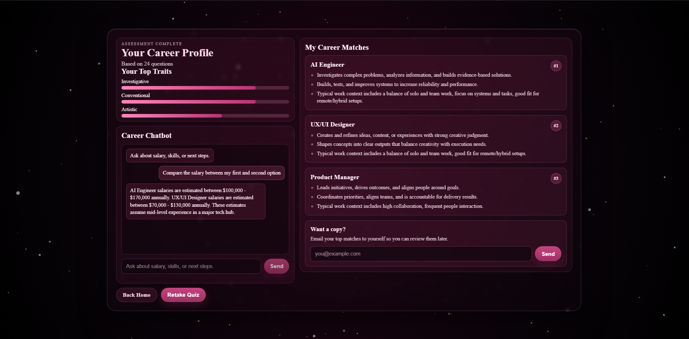
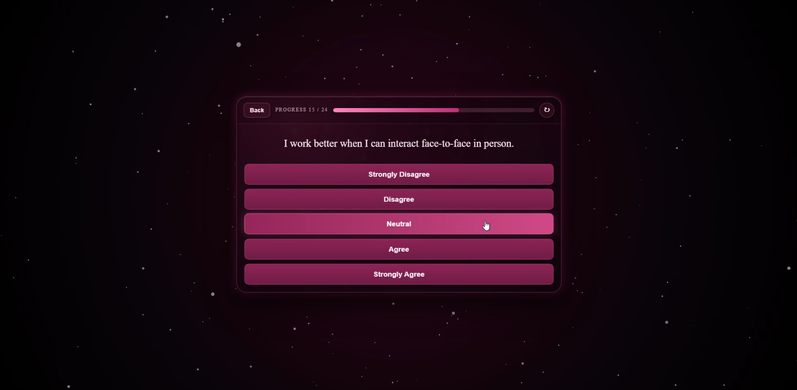
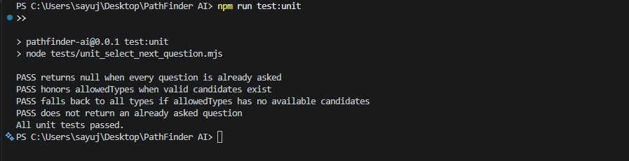

# PathFinder AI

An adaptive career discovery app that personalizes RIASEC quiz flow and connects results to secure AI-guided career exploration.




## Run With Docker

This starts both containers:

- `frontend` on `http://127.0.0.1:5173`
- `chat` on `http://127.0.0.1:8787`

```powershell
docker compose up --build
```

Stop:

```powershell
docker compose down
```

Notes:

- Put `GEMINI_API_KEY` in your local `.env` before starting if you want AI chat enabled.
- The frontend container proxies `/api/*` to the chat container automatically.

## Run Without Docker

1. Start frontend:

```powershell
npm run dev -- --host 127.0.0.1 --port 5173
```

2. In a second terminal, start chat backend (required):

```powershell
npm run dev:server
```

## Prerequisites (Without Docker)

Use these only when running without Docker.

- Node.js 18+
- npm
- Python 3.10+
- Google Chrome or Microsoft Edge (for Selenium test)
- A matching WebDriver available locally (`chromedriver` or `msedgedriver`) if Selenium Manager cannot download one

## Install

```powershell
npm install
```

## AI Integration

The AI chatbot is a core feature of this app.

- Frontend sends chat requests to `POST /api/chat`.
- Vite proxies `/api/*` to `http://127.0.0.1:8787` in local dev.
- Node chat server (`server/index.js`) validates input, applies rate limits, and forwards requests to Gemini.
- Prompt grounding includes the user quiz context:
  - Top traits
  - Top career matches + highlights
  - Recent chat history
- Gemini call logic and prompt rules are in `server/chat.js`.

Required `.env` values for AI chat:

- `GEMINI_API_KEY`
- `GEMINI_MODEL` (default: `gemini-2.5-flash-lite`)
- `CHAT_SERVER_PORT` (default: `8787`)

Recommended for full local experience (quiz + AI chat):

1. Run frontend:
```powershell
npm run dev -- --host 127.0.0.1 --port 5173
```
2. In a second terminal, run chat backend:
```powershell
npm run dev:server
```

## Tests

### 1) Selenium + pytest (UI automation)

This test:

- Runs multiple quiz sessions
- Picks random answers for 12 questions
- Stops at checkpoint
- Compares UI checkpoint top career vs expected computed result

Files:

- `tests/test_quiz_random.py`
- `tests/compute_expected_results.mjs` (helper used by the test)

Run:

```powershell
python -m pytest tests/test_quiz_random.py -q
```

Video example:

https://github.com/user-attachments/assets/e02d33bf-bdf1-48f9-8cdb-2ff32fdf73ab

### 2) Unit test

This test checks `selectNextQuestion` behavior in isolation.

File: `tests/unit_select_next_question.mjs`

Run:

```powershell
npm run test:unit
```

Example:



### Selenium test environment variables

- `FRONTEND_URL` (default: `http://127.0.0.1:5173`)
- `RANDOM_RUNS` (default: `12`)
- `RANDOM_SEED` (optional)
- `SELENIUM_WAIT_SECONDS` (default: `0`, no explicit waits)
- `SELENIUM_BROWSER` (`chrome` or `edge`, default: `chrome`)
- `SELENIUM_HEADLESS` (`0` by default, visible browser)
- `CHROMEDRIVER_PATH` (optional local path)
- `MSEDGEDRIVER_PATH` (optional local path)

Example:

```powershell
$env:RANDOM_RUNS='20'
$env:SELENIUM_BROWSER='chrome'
python -m pytest tests/test_quiz_random.py -q
```

## Notes

- The Selenium test expects the frontend to be running at `FRONTEND_URL`.
- If driver auto-discovery fails, set `CHROMEDRIVER_PATH` or `MSEDGEDRIVER_PATH` explicitly.
